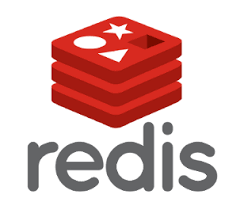
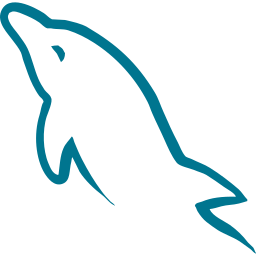
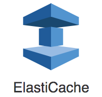

<div align="center">
	


</div>

# ☕ brewscape - 카페로그
#### "공부하기 좋은 카페 없나? 커피가 맛있는 카페 없나?"
* 카페로그는 여러 장소 중에서도 카페 위주의 리뷰를 모아보고 싶은 사용자들을 위한 웹서비스입니다.
* 개개인의 취향에 따라 카페를 탐색하고 기록할 수 있습니다.

<br>

## 📅 개발 기간
#### `2024.12.13 ~ 2025.2.6 (2개월)`

<br>

## 🏃 팀원 소개
|[김병찬](https://github.com/팀원1아이디)|[문남경](https://github.com/팀원2아이디)| [이승헌](https://github.com/팀원3아이디) |[임용태](https://github.com/팀원4아이디)| [이주연](https://github.com/leejuyeon-star)|
| :-------------------------: | :-------------------------: | :----------------------: | :-----------------------: | :-----------------------: |
| Backend | UI/UX Design | Frontend | Frontend | Backend |
|  |  |  |  |  |


<br>

## 🔍 주요 기능

| **카페 검색** | **카페 상세페이지** |
|:---:|:---:|
|  |  | 
| **리뷰 필터링 조회** | **리뷰 작성, 임시저장** |
|  |  | 
| **회원가입, 로그인** | **마이페이지** |
|  |  | 
| **카페 스크랩** |
|  |
<br>

<br>

## 📚 기술 스택

### 프론트
|  |  |  |  |   |
|----------------------------|------------------------------|------------------------------------------|--------------------------|-------------------------------|
| ?                    | ?                        | ?                              | ?                   | ?                |

### 백엔드 
|  |  |  |  |   |
|----------------------------|------------------------------|------------------------------------------|--------------------------|-------------------------------|
| Java 21                    | gradle                       | Spring Boot                              |  Oauth2         | Spring Security               |


|  |  |  |  |  |
|--------------------------|------------------------------|----------------------------------|------------------------------|------------------------------|
|  Spring Data JPA         |  QueryDSL                    | Redis                            | MySQL 8                      | ElastiCache                  |


|  |  |
|------------------------------------|------------------------------|
|  Mockito                           | Junit 5                      |


### DevOps
|  |  |  |  |
|--------------------------------------|------------------------------|----------------------------|--------------------------------------------|
| Github Actions                       | Docker                       |  AWS EC2                          |   AWS RDS                                  |

### 협업툴
|  |  |  |  |
|------------------------------|----------------------------------|--------------------------------|----------------------------------|
| Github                       | notion                           | Figma                          | Discord                           |

<br>

## 🌟 주요 기능 구현
- [김병찬]
	- 로그인/회원가입
    		- oauth2를 이용
    - access, refresh 토큰을 이용하여
  - 카페 조회
    - 네이버 API를 이용한 카페 정보 최신화
- [문남경]
- [이승헌]
- [임용태]
- [이주연]
  	- 리뷰 관련 기능
  	   	- 리뷰 최신순/별점순 조회
		- 리뷰 태그 필터링 조회
  	   	- 카페의 모든 리뷰 조회
		- 리뷰 CRUD
  	- 리뷰 임시저장 관련 기능
  	  	- 내 임시저장 조회
 		- 임시저장 CRUD
	- 이미지 관련 기능
 		- 리뷰 이미지 CRUD
		- 임시저장 리뷰 이미지 CRUD
		- 프로필 이미지 CRUD
  	- 닉네임 랜덤 생성 기능


<br>

## ⚽ 트러블 슈팅
<details>
<summary> 김병찬 </summary>
	
<details>
<summary>~~~문제</summary>

##### `🤔문제 발생`
* 나나
##### `🔍원인 분석`
* 나나
##### `⛏해결 과정`
* 나나
  ```java
  자바 코드
  system.out.println()
  ```
  ```javascript
  자바스크립트 코드
  console.log()
  ```
##### `💎결론`
* 나나
</details>

<details>
<summary>~~~문제</summary>

##### `🤔문제 발생`
* 나나
##### `🔍원인 분석`
* 나나
##### `⛏해결 과정`
* 나나
##### `💎결론`
* 나나
</details>
</details>

<details>
<summary> 문남경 </summary>
</details>
<details>
<summary> 이승헌 </summary>
</details>
<details>
<summary> 임용태 </summary>
</details>
<details>
<summary> 이주연 </summary>
<details>
<summary>DTO 형변환시의 코드 가독성 문제 해결</summary>
<br>
    
<!-- - **DTO 형변환시의 코드 가독성 문제 해결 **** -->
### 🤔문제 발생

- Tuple을 사용하여 DTO를 변환하는 과정에서 코드가 복잡해지고, 가독성이 떨어지며 유지보수에 어려움이 발생했다.

- **문제의 코드**
    - 수동으로 DTO에 매핑하는 구조 → **코드 복잡, 가독성 저하**

    ```jsx
    public ShowReviewResponse findShowReviewResponseById(Long reviewId) {
        List<Tuple> results = queryFactory
                 .from(review)
                .select(review, tag.tagId, reviewImage.id, user)
                .leftJoin(reviewImage).on(review.id.eq(reviewImage.review.id))
                .leftJoin(review.user).fetchJoin()
                .leftJoin(tag).on(review.id.eq(tag.review.id))
                .where(review.id.eq(reviewId))
                .fetch();

        Map<Long, ShowReviewResponse> reviewMap = new HashMap<>();
        Long reviewId = null;
        for (Tuple tuple : results) {
            Review reviewEntity = tuple.get(review);
            Integer tagId = tuple.get(tag.tagId);
            UUID reviewImageId = tuple.get(reviewImage.id);
            User userEntity = tuple.get(user);
            reviewId = reviewEntity.getId();

            ShowReviewResponse res = reviewMap.computeIfAbsent(reviewEntity.getId(), key 
                    -> new ShowReviewResponse(reviewEntity, userEntity));
            if (tagId != null) {
                res.addTagId(tagId);
            }
            if (reviewImageId != null) {
                res.addImageId(reviewImageId);
            }
        }
        return reviewMap.get(reviewId);

    }
    ```


### ⛏해결 과정

## **✅** 시도 1 : @QueryProjection 사용하기

- @QueryProjection을 활용하여 Q타입 DTO 객체를 자동으로 생성하고, 이를 **select()**에서 바로 사용
- **🛠 리팩토링 결과**

    ```java
    public ShowReviewResponse findShowReviewResponseById(Long reviewId) {
        return queryFactory
                .select(new QShowReviewResponse(
                        review,
                        set(reviewImage.id),    
                        set(tag.tagId)
                ))
                .from(review)
                .leftJoin(reviewImage).on(review.id.eq(reviewImage.review.id))
                .leftJoin(review.user).fetchJoin()
                .leftJoin(tag).on(review.id.eq(tag.review.id))
                .where(review.id.eq(reviewId))
                .groupBy(review.id, reviewImage.id, tag.tagId)
                .fetchOne();
    }
    ```


- **문제 발생** : **카테시안 곱 문제가 발생**
    - DISTINCT로는 해결할 수 없음
        - 카테시안 곱에서 발생한 중복 데이터는 해결하지 못한다!
        - left join에 의해 여러 reviewImage와 여러 tag가 하나의 review에 대해 각각 다른 행으로 생성

            → reviewImage.id와 tag.tagId는 개별적으로 그룹화되어 중복된 데이터 생성됨


---

## **✅** 시도 2 : QueryDSL의 groupBy().transform() 사용하기

### ❓일반적인 groupBy와 무엇이 다른가?

- **그룹화 시점이 다르다!**
    - 일반적인 groupBy는 그룹화 로직을 **DB에서 수행**
    - groupBy().transform()은 그룹화 로직을 **메모리에서 수행**

        → **카테시안 곱 문제를** 간단하게 해결할 수 있음


### ❓카테시안 곱 문제를 어떻게 해결할까?

- 메모리에서 그룹화를 수행하기 때문에 복잡한 DB 쿼리 대신 java 라이브러리를 이용할 수 있음

    → java의 set() 함수 이용하여 중복 제거 후 DTO로 변환 가능


### ❓사용시 성능 저하 문제는 없을까?

- **그룹화할 데이터의 양이 적은 경우에만 사용해야 한다!**
    - 그룹화 로직이 메모리에서 처리되므로 데이터를 한 번에 메모리에 로드해야 함

        → 데이터 양이 많으면 CPU와 메모리에 부담을 줄 수 있음

    - **이번 문제의 경우..**
        - 함수 호출시 메모리에 로드되는 최대 행 개수가 25개(카테시안 곱으로 인한 중복 데이터 포함)로, 데이터 양이 적어 성능에 큰 영향 없음


---

## **🛠** 최종 리팩토링 결과

```jsx
public ShowReviewResponse findShowReviewResponseById(Long reviewId) {
    return queryFactory
            .from(review)
            .leftJoin(reviewImage).on(review.id.eq(reviewImage.review.id))
            .leftJoin(review.user).fetchJoin()
            .leftJoin(tag).on(review.id.eq(tag.review.id))
            .where(review.id.eq(reviewId))
            .transform(
                    groupBy(review.id).as(
                            new QShowReviewResponse(
                                    review,
                                    set(reviewImage.id),    // 카테시안 곱 문제 방지를 위해 set 사용
                                    set(tag.tagId)          // 카테시안 곱 문제 방지를 위해 set 사용
                            )
                    )
            )
            .get(reviewId);
}
```

### 💎결론

- **QueryDSL의 groupBy().transform()**을 사용하여 DTO로 변환함으로써 가독성을 높이고, 카테시안 곱 문제도 해결할 수 있었다.
</details>
</details>
</details>


## 🔗 프로젝트 문서
* [노션](https://www.notion.so/18fc5e41552d81bfa985c870e5c2fed4)
* [포스트맨](https://www.postman.com/cafelog/cafelog-team/overview)
* [피그마](https://www.figma.com/design/UPFpjUYoJa0nx1GiQNktp0/%5B2025-%ED%8C%80-%ED%94%84%EB%A1%9C%EC%A0%9D%ED%8A%B8%5D-%EC%BB%A4%ED%94%BC-%EA%B8%B0%EB%A1%9D?node-id=0-1&t=0iUqRTZvxP7KlhpO-1)


